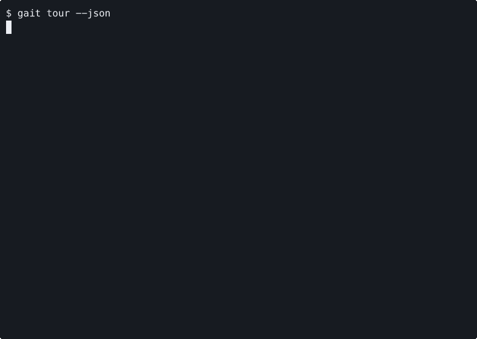

# Gait — Run Durable Agent Jobs, Capture Tool Calls, Prove What Happened

Gait is an offline-first runtime for production AI agents. Dispatch durable jobs with checkpointed state. Capture every state-changing tool call as a signed pack you can verify, diff, and replay. Turn incidents into deterministic CI regressions. Gate high-risk actions with fail-closed policy and approvals before side effects execute.


Public docs: [https://davidahmann.github.io/gait/](https://davidahmann.github.io/gait/)  
Wiki: [https://github.com/davidahmann/gait/wiki](https://github.com/davidahmann/gait/wiki)  
Runpack format: [`docs/contracts/primitive_contract.md`](docs/contracts/primitive_contract.md)  
PackSpec v1: [`docs/contracts/packspec_v1.md`](docs/contracts/packspec_v1.md)  
Changelog: [CHANGELOG.md](CHANGELOG.md)

**For platform and AI engineering teams** that run multi-step and multi-hour agent jobs and need state, provenance, and control without losing work mid-flight.

**For security engineers and production owners** that need every high-risk tool call to pass a deterministic policy decision with portable, independently verifiable proof.

- durable jobs: dispatch long-running work with checkpoints, pause/resume/cancel, and deterministic stop reasons
- signed packs: every run and job emits a verifiable artifact you can attach to PRs, incidents, and audits
- incident-to-regression: one command converts a failure into a permanent CI gate
- fail-closed enforcement: policy decides before the action runs; non-allow means non-execute

## Try It (Offline, <60s)

Install

```bash
curl -fsSL https://raw.githubusercontent.com/davidahmann/gait/main/scripts/install.sh | bash
```

Run demo

```bash
gait demo
```

Verify

```bash
gait verify run_demo
```

Guided activation tour (A1->A4 in one command):

```bash
gait tour
```

Install details: [`docs/install.md`](docs/install.md) (primary path) and [`docs/homebrew.md`](docs/homebrew.md) (alternate path)

## Gait In 20 Seconds


Video recording (MP4): [`docs/assets/gait_demo_20s.mp4`](docs/assets/gait_demo_20s.mp4)

Regenerate asset: `bash scripts/record_runpack_hero_demo.sh` (or `DEMO_PROFILE=activation bash scripts/record_runpack_hero_demo.sh`)

## Why Gait

Autonomous agents are capable enough to execute real work, but teams cannot run them safely at scale. The limiting factor is not intelligence — it is operability and governance: long-running work fails mid-flight, state-changing tool calls are hard to reconstruct, and post-hoc logs are not dispute-grade evidence.

Gait keeps the contract deterministic and offline-first:

- **durable jobs**: dispatch multi-step, multi-hour agent work with checkpointed state, pause/resume/cancel, and deterministic stop reasons (`gait job submit`, `gait job checkpoint`, `gait job status`)
- **signed packs**: unified artifact for runs and jobs — verify, diff, and inspect offline (`gait pack build`, `gait pack verify`, `gait pack diff`)
- **regress**: convert any incident into a permanent CI check with stable exit codes (`gait regress bootstrap`, `gait regress run`)
- **report top**: rank highest-risk actions from runpacks/traces offline (`gait report top`)
- **gate**: enforce policy and approvals at tool-call time — non-allow means non-execute (`gait gate eval`)

If your agent touched production, attach the pack.

## First Win

```bash
gait demo
gait verify run_demo
gait run receipt --from run_demo
```

Expected output includes:

- `run_id=run_demo`
- signed bundle under `gait-out/`
- `ticket_footer=GAIT run_id=...` for PRs/incidents
- `next=...` with deterministic follow-up commands
- `metrics_opt_in=export GAIT_ADOPTION_LOG=...` for local activation tracking

Guided branches:

```bash
gait demo --durable
gait demo --policy
```

## Optional Local UI Playground

Run a local-only UI for guided demo and onboarding flows:

```bash
go build -o ./gait ./cmd/gait
./gait ui --open-browser=false
# open http://127.0.0.1:7980
```

Details: [`docs/ui_localhost.md`](docs/ui_localhost.md) and [`docs/contracts/ui_contract.md`](docs/contracts/ui_contract.md)

## Core OSS Surfaces

- `job`: dispatch durable long-running agent work with checkpointed state, pause/resume/cancel, approval gates, and deterministic stop reasons
- `pack`: unified evidence artifact (run or job) — build, verify, inspect, diff offline with stable schemas and exit codes
- `runpack`: record, inspect, verify, diff, receipt, replay (stub default) for individual tool-call runs
- `regress`: incident-to-regression workflow with CI/JUnit outputs — one command to never ship the same failure again
- `gate`: fail-closed policy evaluation for tool intent with signed trace output and approval/delegation token support
- `doctor`: first-run diagnostics and production-readiness checks
- `mcp proxy/bridge/serve`: transport adapters that enforce through Gate (one-shot, bridged, or long-running service)
- `scout`: local snapshot/diff/signal analysis for drift clustering
- `guard` and `incident`: deterministic evidence and incident bundles
- `registry`: signed/pinned skill-pack install and verify workflows

## Turn Incidents Into CI Regressions

One command path:

```bash
gait regress bootstrap --from run_demo --json --junit ./gait-out/junit.xml
```

Explicit path:

```bash
gait regress init --from run_demo --json
gait regress run --json --junit ./gait-out/junit.xml
```

Deterministic failure contract:

- exit `0` = pass
- exit `5` = regression failed

Template workflow: [`.github/workflows/adoption-regress-template.yml`](.github/workflows/adoption-regress-template.yml)
Drop-in action: [`.github/actions/gait-regress/README.md`](.github/actions/gait-regress/README.md)

## Triage Top Risks Fast

```bash
gait report top --runs ./gait-out --traces ./gait-out --limit 5
```

`gait report top` ranks the highest-risk actions deterministically by tool class and blast radius, then writes `./gait-out/report_top_actions.json`.

## Optional: Enforce At The Tool Boundary

Gait does not auto-intercept your framework. Your dispatcher must call Gait and enforce non-`allow` as non-executable.

```python
def dispatch_tool(tool_call):
    decision = gait_evaluate(tool_call)
    if decision["verdict"] != "allow":
        return {"executed": False, "verdict": decision["verdict"]}
    return {"executed": True, "result": execute_real_tool(tool_call)}
```

Minimal evaluation command:

```bash
gait gate eval \
  --policy examples/policy/base_high_risk.yaml \
  --intent examples/policy/intents/intent_delete.json \
  --trace-out ./gait-out/trace_delete.json \
  --json
```

Policy authoring and rollout docs: [`docs/policy_authoring.md`](docs/policy_authoring.md), [`docs/policy_rollout.md`](docs/policy_rollout.md), [`docs/approval_runbook.md`](docs/approval_runbook.md)
SDK docs: [`docs/sdk/python.md`](docs/sdk/python.md)

## Durable Sessions and Multi-Agent Delegation

Run multi-step, multi-day agent work without losing state or provenance. Checkpoints create verifiable runpacks at each boundary so you can resume, audit, or regress any segment:

```bash
gait run session start --journal ./gait-out/sessions/demo.journal.jsonl --session-id sess_demo --run-id run_demo --json
gait run session append --journal ./gait-out/sessions/demo.journal.jsonl --tool tool.write --verdict allow --intent-id intent_1 --json
gait run session checkpoint --journal ./gait-out/sessions/demo.journal.jsonl --out ./gait-out/runpack_demo_cp_0001.zip --json
gait verify session-chain --chain ./gait-out/sessions/demo.journal_chain.json --json
```

Use delegation tokens for controlled multi-agent handoffs:

```bash
gait delegate mint --delegator agent.lead --delegate agent.specialist --scope tool:tool.write --scope-class write --ttl 1h --private-key ./delegation_private.key --out ./gait-out/delegation_token.json --json
gait gate eval --policy examples/policy/base_high_risk.yaml --intent examples/policy/intents/intent_delegated_egress_valid.json --delegation-token ./gait-out/delegation_token.json --delegation-public-key ./delegation_public.key --json
```

## Integrations

Blessed v2.3 lane:

- [`examples/integrations/openai_agents/`](examples/integrations/openai_agents/)
- [`.github/workflows/adoption-regress-template.yml`](.github/workflows/adoption-regress-template.yml)

Additional maintained references:

- [`examples/integrations/langchain/`](examples/integrations/langchain/)
- [`examples/integrations/autogen/`](examples/integrations/autogen/)
- [`examples/integrations/autogpt/`](examples/integrations/autogpt/)
- [`examples/integrations/openclaw/`](examples/integrations/openclaw/)
- [`examples/integrations/gastown/`](examples/integrations/gastown/)

Integration runbook: [`docs/integration_checklist.md`](docs/integration_checklist.md)

## Production Posture

High-risk profile (`oss-prod`) is fail-closed on policy/approval ambiguity:

```bash
gait gate eval \
  --policy examples/policy/base_high_risk.yaml \
  --intent examples/policy/intents/intent_delete.json \
  --profile oss-prod \
  --key-mode prod \
  --private-key ./gait-out/keys/prod_private.key \
  --credential-broker env \
  --json
```

Readiness command:

```bash
gait doctor --production-readiness --json
```

Hardening references: [`docs/hardening/v2_2_contract.md`](docs/hardening/v2_2_contract.md), [`docs/hardening/prime_time_runbook.md`](docs/hardening/prime_time_runbook.md)

## Command Surface

Most-used commands:

```text
gait demo
gait verify <run_id|path>
gait run inspect --from <run_id|path>
gait job submit --id <job_id>
gait pack build --type <run|job> --from <id|path>
gait pack verify <pack.zip>
gait regress bootstrap --from <run_id|path>
gait report top --runs <csv|run_id|dir> [--traces <csv|dir>]
gait gate eval --policy <policy.yaml> --intent <intent.json>
gait policy test <policy.yaml> <intent_fixture.json>
gait doctor --json
gait ui --open-browser=false
```

All commands support `--json`; most support `--explain`.

## Contract Commitments

- determinism: verify/diff/stub replay are deterministic on identical artifacts
- offline-first: core workflows do not require network
- fail-closed: high-risk paths block on policy/approval ambiguity
- schema stability: versioned artifacts with backward-compatible readers
- stable exit codes: `0` success, `2` verify failure, `3` policy block, `4` approval required, `5` regress failed, `6` invalid input

Normative contract: [`docs/contracts/primitive_contract.md`](docs/contracts/primitive_contract.md)

## Documentation Map

Start here:

1. [`docs/README.md`](docs/README.md)
2. [`docs/concepts/mental_model.md`](docs/concepts/mental_model.md)
3. [`docs/architecture.md`](docs/architecture.md)
4. [`docs/flows.md`](docs/flows.md)
5. [`docs/contracts/primitive_contract.md`](docs/contracts/primitive_contract.md)

## Developer Workflow

```bash
make fmt
make lint
make test
make test-e2e
make test-adoption
make test-contracts
make test-hardening-acceptance
make test-uat-local
```

Local push hooks:

```bash
make hooks
```

- default pre-push path: `make prepush` (fast)
- full local gate: `GAIT_PREPUSH_MODE=full git push`

Apply `main` guardrails (PR-only + required checks):

```bash
make github-guardrails
```

Contributor guide: [`CONTRIBUTING.md`](CONTRIBUTING.md)

## OSS And Enterprise Boundary

- OSS is the execution substrate: durable jobs, signed packs, regressions, fail-closed gates, diagnostics, and adapters
- Enterprise is a separate fleet governance layer that consumes OSS artifacts for cross-team rollout, compliance, and fleet-scale simulation
- Enterprise packaging does not change OSS runtime contracts

Boundary details: [`docs/packaging.md`](docs/packaging.md)

## Feedback

- Issues: [https://github.com/davidahmann/gait/issues](https://github.com/davidahmann/gait/issues)
- Security reporting: [`SECURITY.md`](SECURITY.md)
- Contribution guide: [`CONTRIBUTING.md`](CONTRIBUTING.md)
- Community expectations: [`CODE_OF_CONDUCT.md`](CODE_OF_CONDUCT.md)
