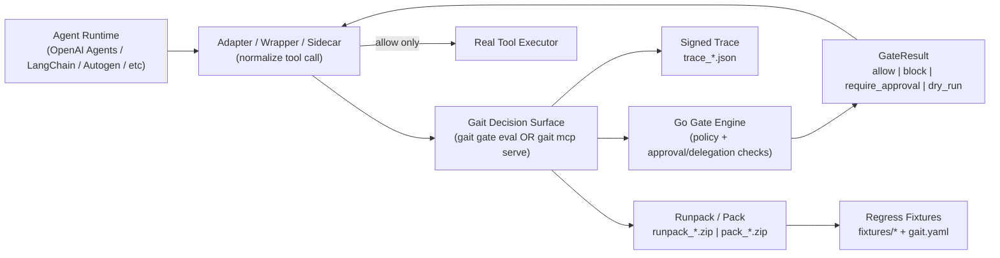
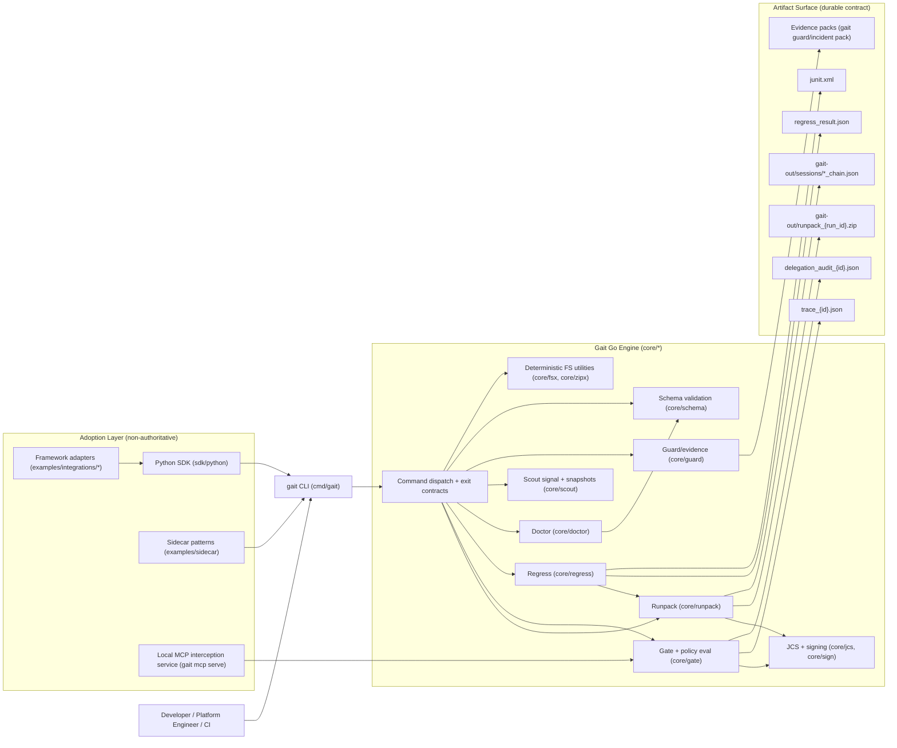

# Gait Architecture

This document is the canonical architecture view for OSS v1.

## Integration-First Architecture

What this is:

- The runtime integration boundary for tool-call control.
- The path that determines whether side effects execute.

What this is not:

- Not an orchestrator diagram for LLM planning/state machines.
- Not a hosted control plane architecture.
- Not evidence that Go Core is "the agent".
- Here "Go Core" means Gait engine internals; the agent runtime is external.

## Tool Boundary (Canonical Definition)

A tool boundary is the exact call site where your runtime is about to execute a real side effect.

- your code at the boundary: wrapper/adapter serializes `IntentRequest`
- Gait decision surface: `gait gate eval` or `gait mcp serve`
- enforcement rule: non-`allow` means non-execute

Ownership lanes:

- your code: `Agent Runtime` + `Adapter / Wrapper / Sidecar`
- Gait layer: `gait` decision surface + policy/artifact engine
- external system: `Real Tool Executor`

## Component Architecture (Implementation Internals)

## Integration Path Anchors (Repo)

- canonical wrapper integration: `examples/integrations/openai_agents/quickstart.py`
- command surface wiring: `cmd/gait/`
- gate and policy logic: `core/gate/`
- durable jobs lifecycle: `core/jobruntime/`
- pack and runpack verification: `core/pack/`, `core/runpack/`
- schema contracts: `schemas/v1/`

## Runtime Boundaries

- **Authoritative boundary**: Go core owns policy decisions, canonicalization, signing, schema validation, determinism, and exit codes.
- **Adoption boundary**: Python and sidecars should only serialize intent, call CLI, and interpret structured results.
- **Durable contract boundary**: artifacts and schemas are the long-lived API surface, not in-memory implementation details.

## State And Persistence

- Working artifacts: `./gait-out/`
- Session journals and chains: `./gait-out/sessions/*` (append-only journal + checkpoint chain)
- Session hot-path state index: `*.journal.jsonl.state.json` (lock-protected append state cache)
- MCP serve runtime traces: `./gait-out/mcp-serve/traces`
- MCP serve retention/rotation applies at trace/runpack/session directory boundaries when configured
- Regress fixtures/config: `fixtures/` and `gait.yaml`
- Optional local caches: `~/.gait/runpacks`, `~/.gait/registry`
- Schema contracts: `schemas/v1/*` with matching Go types/validators under `core/schema/*`

## Failure Posture

- Default-safe behavior is enforced in command handlers: non-`allow` gate outcomes do not execute side effects.
- High-risk production profile (`oss-prod`) remains fail-closed when policy or credentials cannot be evaluated.
- Delegation-constrained policies remain fail-closed when required delegation evidence is absent/invalid.
- Verification and regression failures return stable non-zero exit codes for automation.
