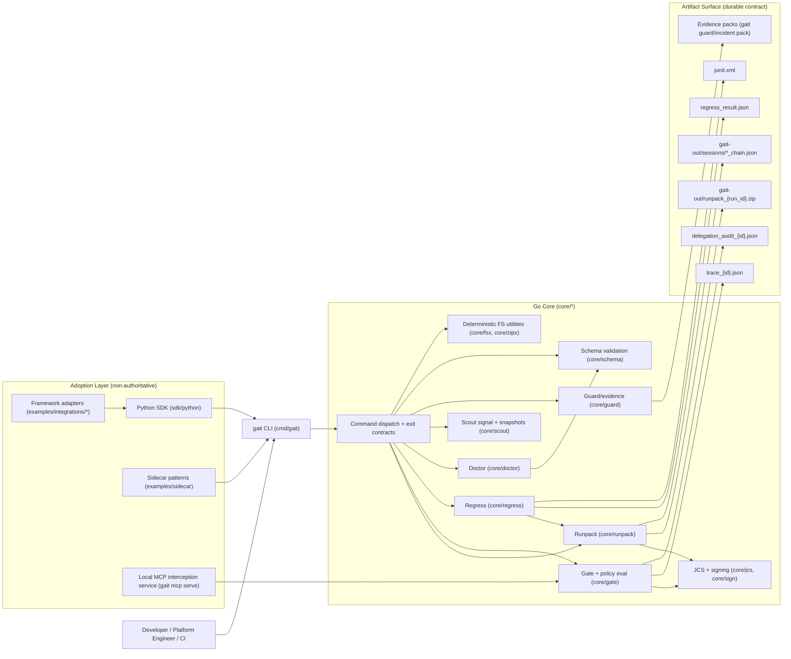

# Gait Architecture

This document is the canonical architecture view for OSS v1.

## Component Architecture

## Runtime Boundaries

- **Authoritative boundary**: Go core owns policy decisions, canonicalization, signing, schema validation, determinism, and exit codes.
- **Adoption boundary**: Python and sidecars should only serialize intent, call CLI, and interpret structured results.
- **Durable contract boundary**: artifacts and schemas are the long-lived API surface, not in-memory implementation details.

## State And Persistence

- Working artifacts: `./gait-out/`
- Session journals and chains: `./gait-out/sessions/*` (append-only journal + checkpoint chain)
- MCP serve runtime traces: `./gait-out/mcp-serve/traces`
- Regress fixtures/config: `fixtures/` and `gait.yaml`
- Optional local caches: `~/.gait/runpacks`, `~/.gait/registry`
- Schema contracts: `schemas/v1/*` with matching Go types/validators under `core/schema/*`

## Failure Posture

- Default-safe behavior is enforced in command handlers: non-`allow` gate outcomes do not execute side effects.
- High-risk production profile (`oss-prod`) remains fail-closed when policy or credentials cannot be evaluated.
- Delegation-constrained policies remain fail-closed when required delegation evidence is absent/invalid.
- Verification and regression failures return stable non-zero exit codes for automation.
