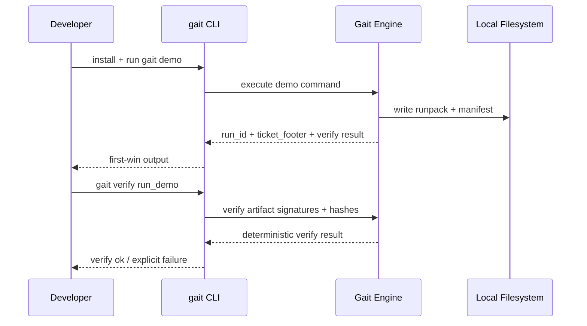
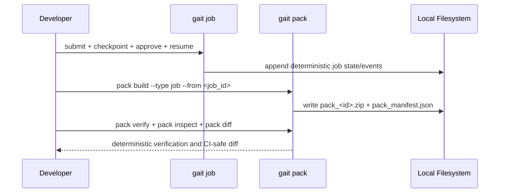
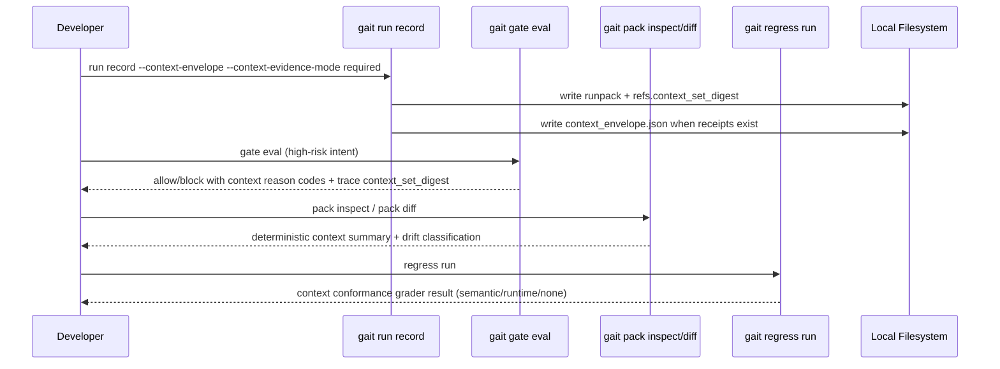
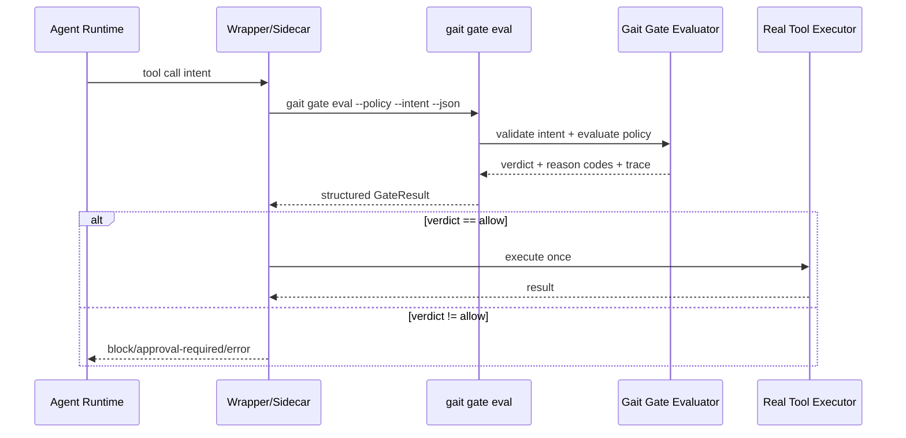
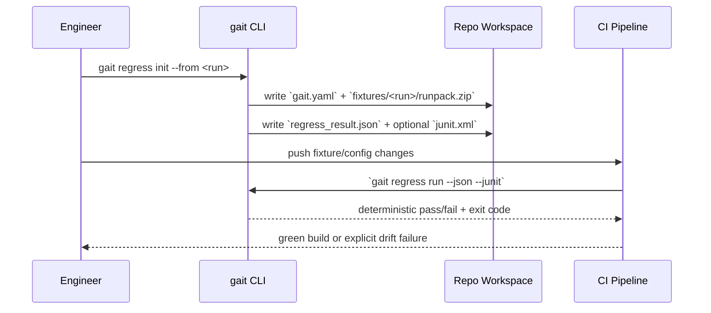
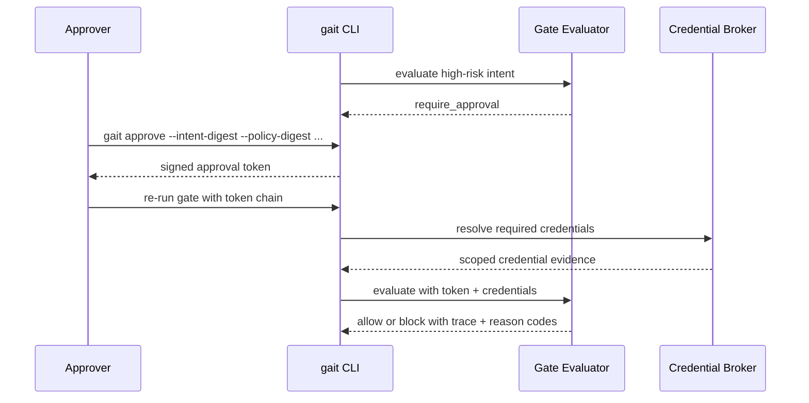
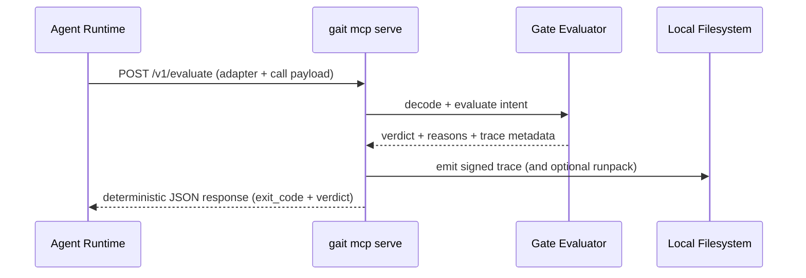
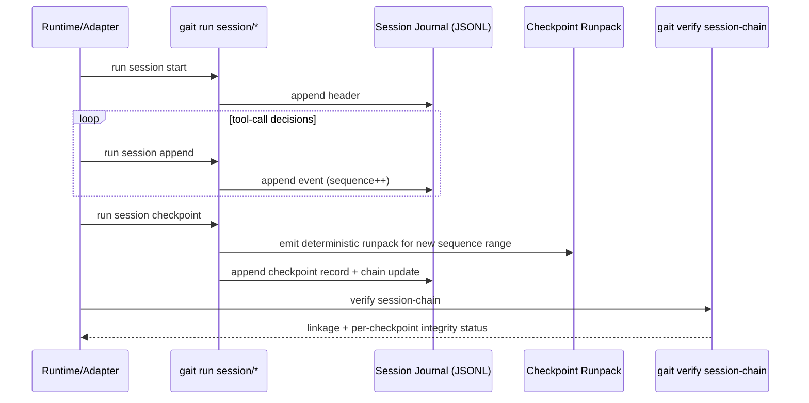
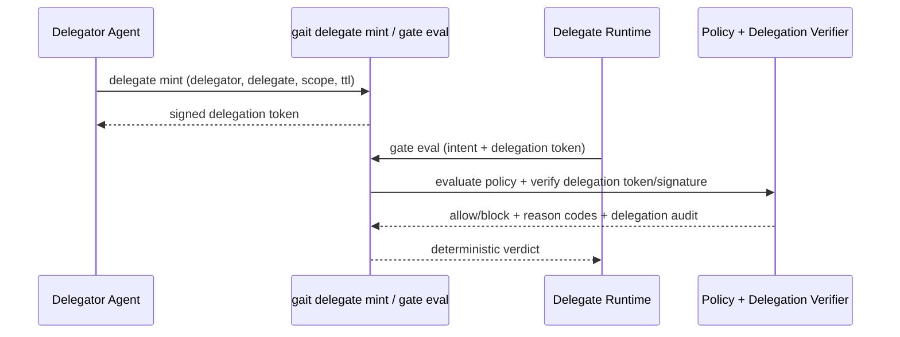

# Gait Flow Diagrams

This document is the canonical runtime flow reference for OSS v1.

## Actor and Plane Legend

Actor legend:

- `Agent Runtime`: your external agent framework/runtime.
- `Adapter`: wrapper/sidecar/middleware that calls Gait and enforces non-`allow` as non-executable.
- `gait CLI/Core`: local Gait command path and Go policy/artifact engine.
- `Operator`: human/platform engineer/approver.
- `CI`: pipeline that runs deterministic regress and policy checks.

Plane legend:

- Runtime plane: live tool-call decision boundary.
- Operator plane: local commands, demos, inspections.
- CI plane: fixture-driven regressions and release gates.

## Tool Boundary (Canonical Definition)

A tool boundary is the exact call site where your runtime is about to execute a real tool side effect.

- boundary input: structured `IntentRequest`
- decision call: `gait gate eval` (or `gait mcp serve`)
- hard enforcement rule: non-`allow` means non-execute

Primary repo anchors for this boundary:

- `examples/integrations/openai_agents/quickstart.py`
- `cmd/gait/gate.go`
- `core/gate/`

## 1) First-Win Flow (Install -> Demo -> Verify)

What this flow is:

- Operator plane onboarding to generate and verify first artifacts.

What this flow is not:

- Not an external agent runtime integration flow.
- `Gait Engine` here is Gait internals, not "the agent."

Value: produces a portable artifact and verifiable ticket footer in minutes.

## 1b) Unified Job + Pack Flow

What this flow is:

- Operator plane durable execution/evidence lifecycle.

What this flow is not:

- Not the adapter-level runtime enforcement path for third-party agents.

Outcome: durable runtime control and portable evidence under one pack contract.

## 1c) Context Evidence Proof Flow

What this flow is:

- Operator + CI proofrail flow for context evidence integrity.

What this flow is not:

- Not a replacement for runtime adapter enforcement.

Outcome: context usage is deterministic, auditable, and release-gatable without weakening offline-first behavior.

## 2) Execution-Boundary Gate Flow

What this flow is:

- The runtime plane chokepoint for real side-effect control.

What this flow is not:

- Not optional if you need fail-closed enforcement.

Rule: only wrapped paths may execute tools; non-`allow` verdicts never execute side effects.

## 3) Incident -> Regression -> CI Gate

What this flow is:

- CI plane conversion of incidents into permanent gates.

What this flow is not:

- Not live runtime gating for current tool calls.

Outcome: one incident becomes a permanent deterministic regression check.

## 4) High-Risk Approval Flow

What this flow is:

- Runtime plane human-in-the-loop approval path when policy returns `require_approval`.

What this flow is not:

- Not only a CI concept. CI may verify this path, but runtime execution is where approvals block/allow side effects.

Trigger summary:

- runtime: `gait gate eval` returns exit `4`/`require_approval` for matched high-risk rules.
- CI: same exit/verdict can block promotion pipelines until approved evidence path is present.

Outcome: high-risk actions require explicit, auditable approval and credential proof.

## 5) MCP Runtime Interception Service

What this flow is:

- Runtime plane HTTP decision surface for agent runtimes that can call a local service.

What this flow is not:

- Not a full replacement for all CLI flows (`regress`, `doctor`, `pack inspect/diff`, etc).
- Not automatic tool enforcement: caller runtime must still block execution on non-`allow`.

Rule: default bind is loopback and non-`allow` outcomes remain non-executing at the caller.

Hardening note: for non-loopback service binds, configure `--auth-mode token --auth-token-env <VAR>`, bounded `--max-request-bytes`, strict verdict mode (`--http-verdict-status strict`), and retention caps (`--trace-max-*`, `--runpack-max-*`, `--session-max-*`).

Enforcement note: `POST /v1/evaluate` returns a decision payload only. The runtime that called the endpoint must still enforce `if verdict != allow: do not execute side effects`.

Transport endpoints:

- `POST /v1/evaluate` -> JSON response
- `POST /v1/evaluate/sse` -> `text/event-stream` response
- `POST /v1/evaluate/stream` -> `application/x-ndjson` response

## 6) Long-Running Session Checkpoint Chain

What this flow is:

- Runtime/operational durability path for long-running sessions with incremental checkpoints.

What this flow is not:

- Not limited to only one special runtime mode; it is explicit checkpoint support for multi-step/multi-day execution.

Outcome: multi-day execution can be checkpointed incrementally and verified as a linked chain.

Operational note: use `gait run session compact --journal <path>` to prune already-checkpointed events while preserving chain verification.

## 7) Delegation Token Enforcement

What this flow is:

- Runtime plane constrained delegation using signed token evidence and scope bindings.

What this flow is not:

- Not a full IdP/OIDC token exchange system. Enterprise identity/token lifecycle remains external; Gait validates delegation evidence presented at evaluation time.

Rule: when policy requires delegation, missing/invalid delegation evidence remains non-executable (`block`).
