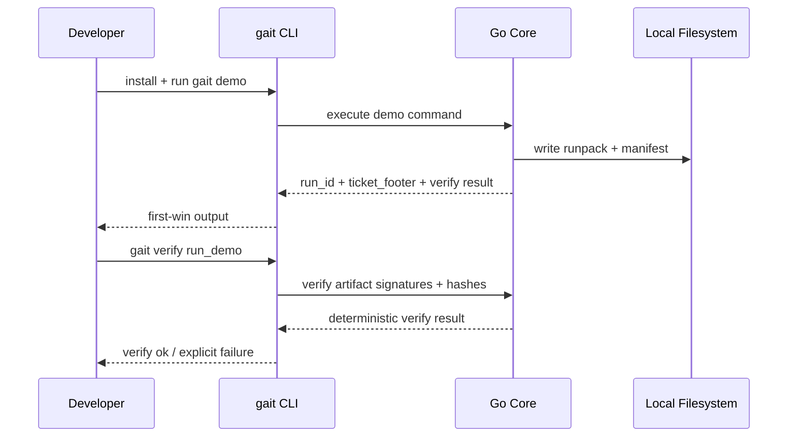
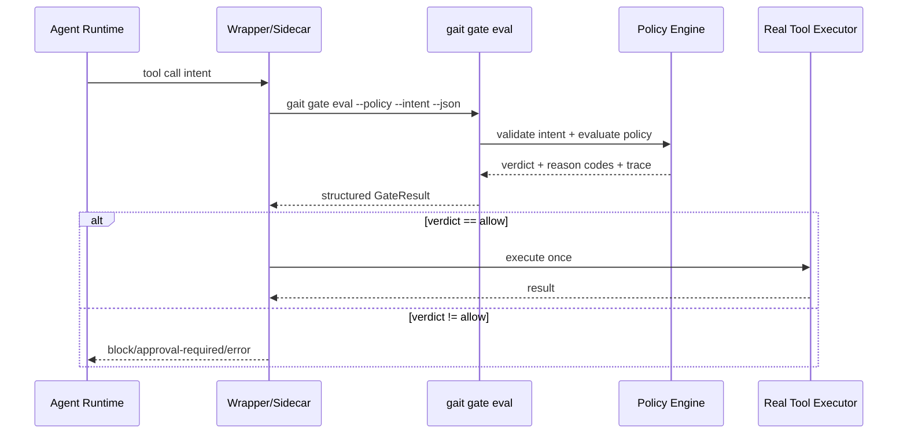
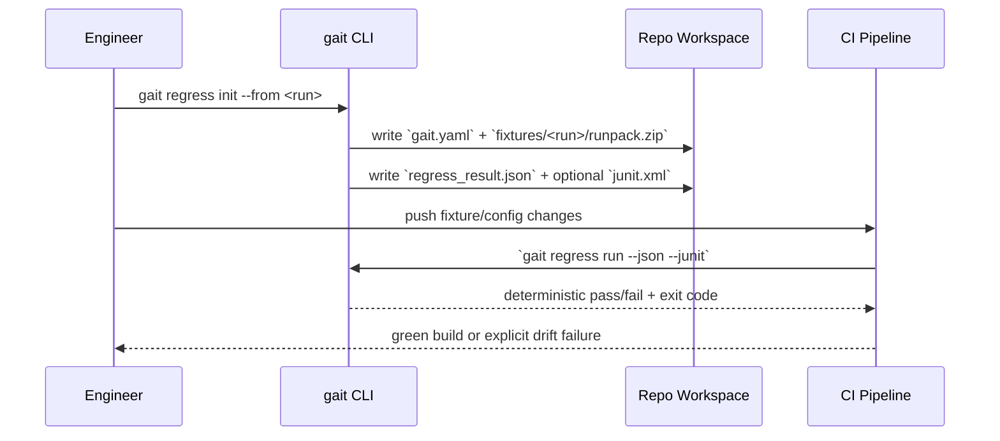
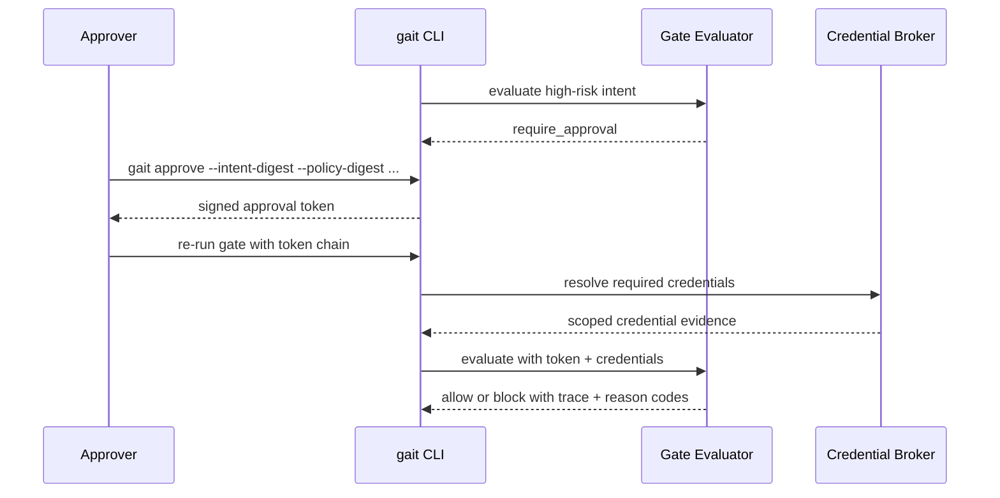
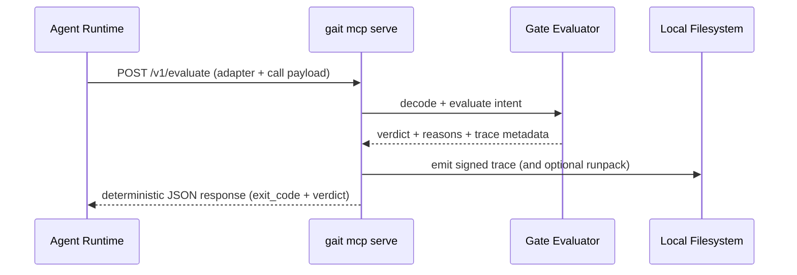

# Gait Flow Diagrams

This document is the canonical runtime flow reference for OSS v1.

## 1) First-Win Flow (Install -> Demo -> Verify)

Value: produces a portable artifact and verifiable ticket footer in minutes.

## 2) Execution-Boundary Gate Flow

Rule: only wrapped paths may execute tools; non-`allow` verdicts never execute side effects.

## 3) Incident -> Regression -> CI Gate

Outcome: one incident becomes a permanent deterministic regression check.

## 4) High-Risk Approval Flow

Outcome: high-risk actions require explicit, auditable approval and credential proof.

## 5) MCP Runtime Interception Service

Rule: default bind is loopback and non-`allow` outcomes remain non-executing at the caller.

Enforcement note: `POST /v1/evaluate` returns a decision payload only. The runtime that called the endpoint must still enforce `if verdict != allow: do not execute side effects`.

Transport endpoints:

- `POST /v1/evaluate` -> JSON response
- `POST /v1/evaluate/sse` -> `text/event-stream` response
- `POST /v1/evaluate/stream` -> `application/x-ndjson` response
